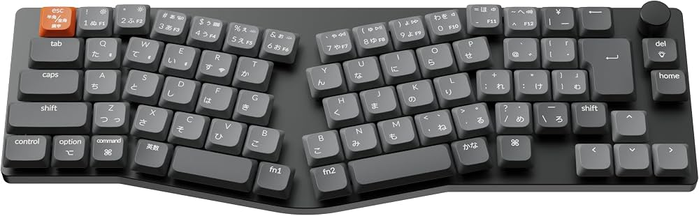

# [Keychron K11 Max](./keyboards/keychron/k11_max) JIS [Miryoku](https://github.com/manna-harbour/miryoku/tree/master/docs/reference) [keymap](./keyboards/keychron/k11_max/jis_encoder/rgb/keymaps/miryoku/keymap.c)

## Artefacts

- [Keymap](./keyboards/keychron/k11_max/jis_encoder/rgb/keymaps/miryoku/keymap.c) - read it first
- [Build script](./build.sh) — currently supports Arch Linux for dependency installation

## Key Features

- Full [Miryoku](https://github.com/manna-harbour/miryoku/tree/master/docs/reference) implementation, including all features and default layers
- Esc/Media layer moved to Caps Lock
- TAP layer is intended for gaming and provides access to a dedicated Gaming Fn layer
- BASE layer is qwerty for easier software layout selection
- EXTRA uses [Gallium v2](https://github.com/GalileoBlues/Gallium/) as the alpha layout. Feel free to replace it with your preferred layout
- BACK/EXTRA pair can also used as a second-language layer.
- Combos switch between BASE and EXTRA while also switching the system keyboard layout. Disabled by default, set `COMBO_ENABLE = yes` in rules.mk to enable combos.
- Linux/Windows-oriented configuration. Set "MODE_MAC" to adapt the keymap for macOS
- ":;" is changed to "/?" in the NUM and SYM layers to work better with [Gallium](https://github.com/GalileoBlues/Gallium/), which does not include "/?" in its 3×5 block. It also allows to keep BASE as plain QWERTY, enabling correct software layout selection.
